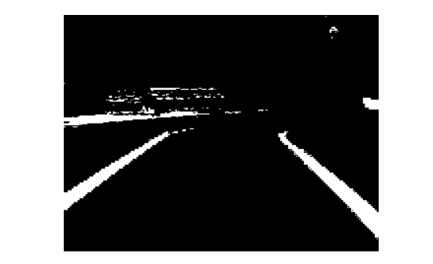
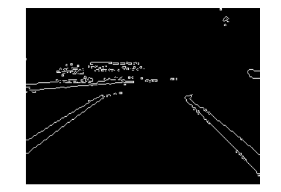

# Self_Driving_Car

## This Project consists of two modes 
### 1. Manual Mode
### 2. Automatic Mode

---

## 1. **Manual Mode**
* The user select from the mobile ui ( Manual Mode ). 
* The user starts to select the direction where the car would move. 
* The car recieves the required direction through the esp WiFi module.
* The WiFi module starts to send this direction to the arduino which will lead the motors to move in this direction.

### Mobile UI Sample

## 1. **Automatic Mode**
* The user select from the mobile ui ( Automatic Mode ). 
* The car webcam starts to take images of the car lane.
* The webcam starts to send the images to the server.
* The server starts to send the image to the lane detection algorithm to detect the direction which the car should move to.
* The server sends the result direction to the esp WiFi module.
* The WiFi module sends the direction to the arduino to make the motors move to this direction.
### Mobile UI Sample

## Project code structure:

### 1. Server app:
* Responsible for sending and receiving images to be processed and directions between the mobile and the car esp WiFi module.
* Tools used:
    -   flask
    -   python

### 2. Mobile app:
* Responsible for switching between different modes and sending directions to the server in case of manual mode.
* Tools used:
    -   React js

### 3. WebCam:
* Responsible for capturing pictures of the lane and sending them to the server in case of automatic mode.

### 3. Computer Vision algorithm:
* Responsible lane detection and specify the correct direction.
* Steps of lane detection algorithm:

    1. Isolate the Color of the Lane:

        

    2. Turn the color space used by the image, which is RGB (Red/Green/Blue) into the HSV (Hue/Saturation/Value) color space.
        
        

    3. lift all the blueish colors from the image by specifying a range of the color Blue.

        

    4. Detecting Edges of Lane Lines using canny edge detection.

        

    5. Isolate Region of Interest

        

    6. Detect Line Segments using Hough Transform

        

    7. Motion Planning: Steering Angle
        * Now that we have the coordinates of the lane lines, we need to steer the car so that it will stay within the lane lines, even better, we should try to keep it in the middle of the lane. Basically, we need to compute the steering angle of the car, given the detected lane lines.

        

    8. Depending on the steering angle we deside the direction:
    *  0  <= steering_angle <= 85  : **Right**
    *  85 <  steering_angle < 92   : **Forword**
    *  92 <= steering_angle <= 180 : **Left**
